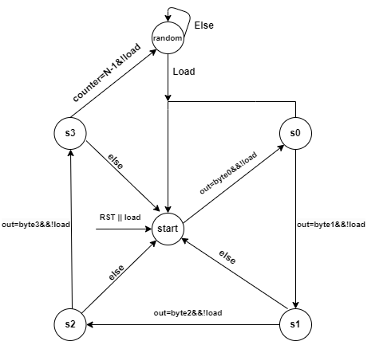
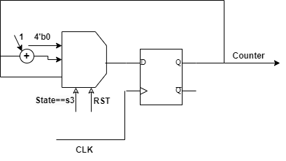
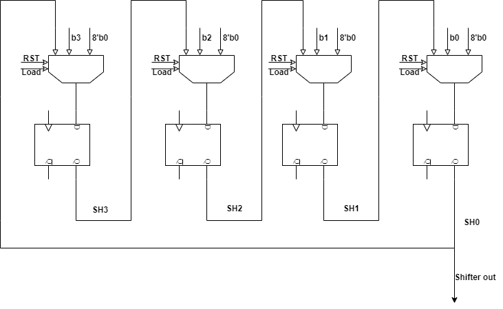
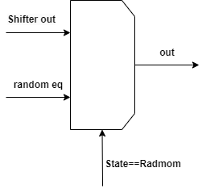

## Custom PRBS-15 Block

The Custom PRBS-15 (Pseudo-Random Binary Sequence) Block is a digital design used for generating pseudo-random sequences, which can be applied in various communication and cryptographic systems. The design is composed of several key components, each working together to achieve the desired functionality.

### Design Components
1. **FSM (Finite State Machine)**:  
   The FSM is the control unit of the design, consisting of 6 distinct states. Each state governs the operation of the other modules in the system, such as loading inputs, shifting data, or counting sequences. The state transitions are triggered by signals like `reset_n`, `load`, and clock pulses, and the FSM ensures that the sequence generation and randomization occur in a controlled manner.  
   

2. **Counter**:  
   The counter is responsible for keeping track of how many  sequences have been detected. It increments with each successful sequence match and can reset or pause based on the FSM's state. This module is crucial for determining the completion of a sequence detection cycle.  
   

3. **Rotated Shifter**:  
   The rotated shifter is used to generate the  sequences. It operates by shifting a 32-bit input byte (`in_byte_4`) through a series of shifts, producing a rotated version of the input. The output from the shifter is used both as a feedback for the FSM and as part of the sequence output that drives the PRBS process.  
   

4. **Selector**:  
   The selector chooses between two possible outputs: the output from the rotated shifter or a pre-defined random equation. This component is key to switching between generating sequences from the shifter and introducing randomization into the output when necessary, adding versatility to the sequence generation process.  
   

### Test Cases

To ensure the correctness of the design, the following test cases have been developed and simulated:

1. **Test Reset Functionality**:  
   Verifies that the system properly resets all internal states, counters, and outputs when the `reset_n` signal is asserted.

2. **Test Load Functionality**:  
   Confirms that the design correctly loads the input byte (`in_byte_4`) when the `load` signal is activated.

3. **Test Sequence Detection**:  
   Checks the system’s ability to detect and correctly shift based on the input and FSM states.

4. **Test Randomization Process**:  
   Ensures that the system produces randomized sequences when the selector chooses the random equation.

### Limitations

1. **Random State as Flag**:  
   In this design, a random state is used as a flag to indicate transitions and state changes. This may introduce ambiguity or make the system less deterministic compared to a state machine where transitions are driven by more explicit conditions.

2. **Repetition of Random Numbers**:  
   One limitation of the design is that the random numbers generated repeat with every 4-clock cycles This behavior may reduce the effectiveness of the randomization process.
